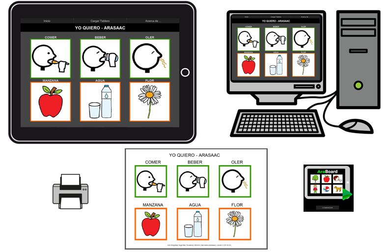

# U2. AraBoard

AraBoard es un conjunto de herramientas diseñadas para la comunicación alternativa y aumentativa, cuya finalidad es facilitar la comunicación funcional, mediante el uso de imágenes y pictogramas, a personas que presentan algún tipo de dificultad en este ámbito. Dada la versatilidad de estas herramientas, AraBoard también puede ser utilizado para crear tableros con rutinas sencillas y tableros para anticipar la realización de cualquier tarea.

AraBoard nos permite crear, editar y usar tableros de comunicación para distintos dispositivos (ordenador, smartphone o tablet), así como para distintos sistemas operativos. Se compone de dos herramientas complementarias:

- **AraBoard Constructor:** Esta herramienta se utiliza para la creación y edicion de los tableros de comunicación. mediante la colección de pictogramas Arasaac y cualquier otra imagen y audio almacenados en el dispositivo.

- **AraBoard Player:** Esta herramienta se utiliza para ejecutar los tableros de comunicación previamente creados en AraBoard Constructor.

AraBoard se caracteriza por su sencillez de uso en todos los aspectos, ya que posee una interfaz gráfica diseñada para que cualquier persona pueda crear y editar tableros de forma intuitiva.

Con AraBoard podemos crear tableros desde una hasta treinta y dos casillas, utilizando para ello las distintas combinaciones posibles: 1 fila x 2 columnas, 2 filas x 2 columnas, 3 filas x 4 columnas,..., 4 filas x 8 columnas. Esta característica convierte también a la herramienta en una posible alternativa para personas con discapacidad motriz y necesidades comunicativas muy básicas.

AraBoard ha sido desarrollada por Marta García Azpiroz (Proyecto Fin de Carrera en el Grupo GIGA-Affective Lab, EINA, Universidad de Zaragoza) y Javier Marco Rubio (Grupo GIGA-Affective Lab, EINA, Universidad de Zaragoza)bajo la dirección de Sandra Baldasarri y Eva Cerezo, Profesoras del Departamento de Informática e Ingeniería de Sistemas de la Universidad de Zaragoza y el grupo GIGA-Affective Lab, EINA, Universidad de Zaragoza.

## Tarea

Para aprender el funcionamiento básico de AraBoard accede a la [esta página](http://aulaabierta.arasaac.org/araboard-para-pc-y-para-s-o-android-0-inicio).

Puedes descargar el software del siguiente enlace:

[http://aularagon.catedu.es/materialesaularagon2013/arasaac/Docs/Manual_AraBoard.pdf](http://aularagon.catedu.es/materialesaularagon2013/arasaac/Docs/Manual_AraBoard.pdf)
